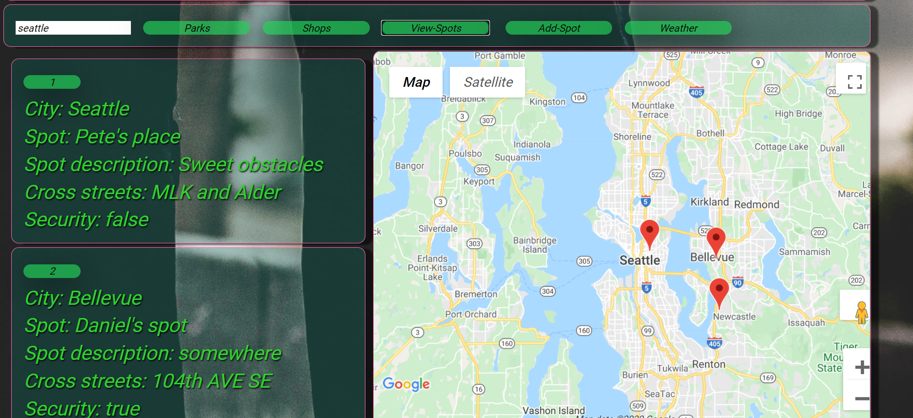
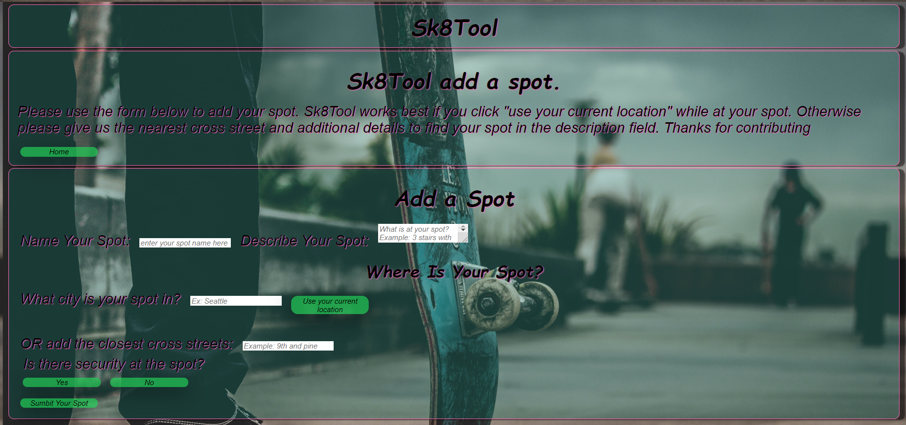

# Project-02-Sk8Tool

- [Story](#story)
- [Usage](#usage)
- [Project Description](#projectDescription)
- [Language](#language)
- [Repositories](#repositories)
- [Authors](#authors)

## Story

For years you could find baseball and softball fields everywhere as well as soccer 
fields, basketball and tennis courts. Skateboarding and skateboarders 
however were relegated to finding their own places to practice and do tricks.
The skateparks that did exist cost money to use and required waivers and pads 
to even walk into while not providing a wide array of obstacles to use. Now skateparks are are much more common and often free. We built Skatefinder to help skaters find parks and shops easily.

  But it's not the whole story of skateboarding. Many if not all skaters are still always on the lookout for new places to skate and do tricks. What most people see as stairs or handrails,
benches or embankments skateboarders see as obstacles to be conquered and 
do tricks on. It’s so pervasive a part of the urban environment that most 
architecture and engineering also includes deterrents to skateboarders and
skateboard related wear and tear.

  This is where Ska8Tool comes in. We’ve provided a database where 
 skateboarders can share and look up spots to skate at.

## ProjectDescription

  With Ska8Tool you can still easily search for parks and shops. We didin't stop there though and we have added a database where skaters can add and store spots. They have the ability to drop a pin while they're there, or just enter the nearest cross streets so that it can be found on the map. They can also add a description and even let other skaters know if there is security present at the spot and when. 
    
    

## Usage

1. Main page: Input search city and look for the park, shop, weather, and view the spots in the database

2. Add page: Add user favorite skate spots into the database. The spots include city, streets, description, and security

## Language

- [`Java Script`](https://www.javascript.com/)
- [`Jquery`](https://jquery.com/)
- [`Handlebars`](https://handlebarsjs.com/)
- [`CSS`](https://en.wikipedia.org/wiki/CSS)
- [`MySql`](https://www.mysql.com/)
- [`NodeJS`](https://nodejs.org/en/)
- [`npm`](https://www.npmjs.com/)
- API’s : [`Open Weather`](https://openweathermap.org/api), [`Google maps`](https://developers.google.com/apis-explorer)

## Repositories
* Project Home Page: https://sk8fndr.herokuapp.com
* Project Github: https://github.com/DanielYu0864/Project-02DanielYu-HomeWork-9-Good-README-Generator
## Authors
 [Daniel Yu](https://github.com/DanielYu0864), [Pete Low](https://github.com/PeteLow-13), [Vasile Tronciu](https://github.com/tronciu92)